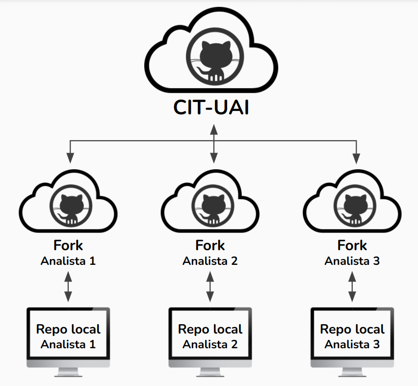
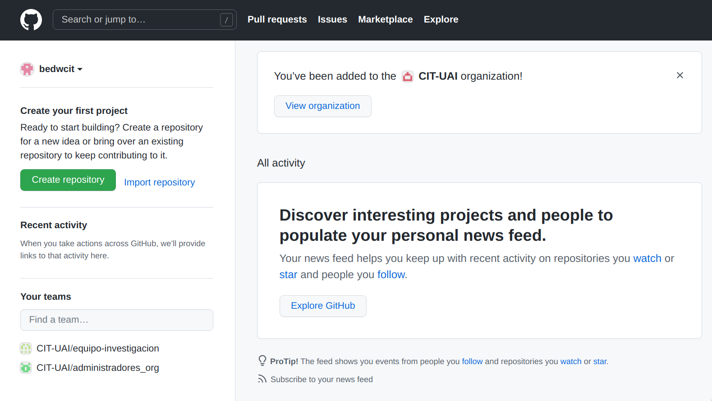

# Git + GitHub {#git}

## Configuración de repositorios {#repos_config}

### Crear repositorio

Podemos hacer repositorio de dos formas distintas.

Página web de GitHub

1. Primero iniciamos sesión en [GitHub](http://github.com)
    
2. Hacemos click en `Create repository`. Luego como `owner` seleccionamos la organización `CIT-UAI`

Luego le damos a `Create repository`
3. Ahora ya tenemos el repositorio creado en GitHub
 Ahora ya podemos [hacer un Fork](#crear_fork)

GitHub Desktop

1. Luego de iniciar sesión el la aplicación, en el menú ponemos `File > New repository...`

2. Rellenamos la información del repositorio nuevo

3. Hacemos click en `Create repository` para crear el repositorio de
    forma local
4. Luego la aplicación nos muestra lo siguiente. Hacemos click en
    `Publish repository` para subir el repositorio a GitHub
    
5. Nos aseguramos de seleccionar `CIT-UAI` en el campo `Organization` .

6. Hacemos click en `Publish repository` para confirmar. Con esto **subimos el repositorio** que acabamos de crear localmente, **al perfil (en GitHub) de la organización** `CIT-UAI`
7. La aplicación ahora se ve como la imagen a continuación

Si en el menú nos vamos a `Repository > View on GitHub` , veremos

 
Ahora estamos listos para [hacer un Fork](#crear_fork)

### Crear un Fork {#crear_fork}

1. Nos vamos a la página de GitHub del repositorio al que queremos hacerle el `Fork` . Hacemos click en el botón que dice `Fork` en la esquina superior derecha.

2. Seleccionamos nuestra cuenta de GitHub

3. Ahora, en la parte superior izquierda vemos que el repositorio ahora se encuentra en nuestro perfil, y que es un fork del repositorio del mismo nombre, pero del perfil `CIT-UAI`

Ya tenemos el Fork creado, y ya podemos [clonarlo](#clonar_fork)
### Clonar Fork {#clonar_fork}

1. Con un Fork ya creado, en la aplicación GitHub Desktop, en el menú, nos iremos a `File > Clone repository...`

2. En el menú que se nos abre, refrescamos la lista de repositorios

3. Vemos como aparece el repositorio al que le hicimos `Fork`

4. Lo seleccionamos y le damos click a `Clone`.
<figure class="block-color-gray_background callout" style="display:flex">

️
<svg width="30px" style="margin-top:-24px"><image xlink:href="https://super.so/icon/dark/alert-triangle.svg"/></svg>

Es posible que de un problema con la carpeta de destino. Esto ocurrirá **si anteriormente se creó el repositorio para el perfil de la organización** (el repositorio del perfil UAI-CIT) **desde el mismo computador que estás ocupando ahora**.

Esto lo podemos solucionar de dos formas sencillas

<strong>Solución 1</strong>

<ul style="list-style-type:none">
<li>

La primera forma es corrigiendo el nombre de la carpeta de destino. Sugerimos añadir `_fork` al nombre de la carpeta de destino.

Con esto la franja mostrando el error desaparece, y podemos hacer click en `Clone` sin problemas, y podemos [continuar](#terminar_fork).

<em>Observación</em>

<ul style="list-style-type:none"><li>
[Luego de terminar de clonar el Fork](#terminar_fork) en la lista de repositorios veremos los repositorios que se llaman igual, pero indicando a que perfil de GitHub es cada uno.

Por otro lado en el visor de archivos veremos dos carpetas

Acá <code>repositorio1</code> es la copia local del repositorio del perfil CIT-UAI, mientras que <code>repositorio1_fork</code> es la copia local del repositorio del perfil personal.

</li></ul>

</li></ul>

<strong>Solución 2 (recomendada)</strong>

<ul style="list-style-type:none"><li>

La segunda solución es, antes de hacer el fork, eliminar la copia local del repositorio que creamos para la organización.

Para esto, en el menú, nos vamos a `View > Repository list` . Hacemos click derecho en el repositorio que vamos a borrar. En este ejemplo el repositorio es `repositorio1` y está bajo el nombre de la organización `cit-uai`

Hacemos click `Remove...`

Marcamos la opción `Also move this repository to Recycle Bin` y confirmamos haciendo click en el botón `Remove`

Es importante precisar que esto **NO borra el repositorio en GitHub**, sino que solo **borra la copia local** de este.

Ahora podemos repetir los pasos anteriores ([desde el 1 en adelante](#clonar_fork))

<em>Observación</em>

<ul style="list-style-type:none"><li>

[Luego de terminar de clonar el Fork](#terminar_fork), en la lista de repositorios veremos solo un repositorio (con el nombre del repositorio al que le hicimos el Fork) indicando pertenece a nuestro perfil personal de GitHub.

De forma similar, en el visor de archivos solo veremos una carpeta (con el nombre del repositorio al que le hicimos el Fork)

</li></ul>

</li></ul>

</figure>

5. Nos aparecerá la siguiente ventana, donde podemos escoger entre dos opciones.

La opción `To contribute to the parent project` es ideal si el
repositorio tiene (o tendrá) códigos que tú y tu equipo van a
**desarrollar**.

***Ejemplo***

<blockquote>Tu y tu equipo van a **desarrollar distintos códigos para el cálculo de algún indicador**. En este repositorio aún se están probando **mejoras** al cálculo, **optimizaciones**, o **características**.</blockquote>
Por otro lado, la opción `For my own purposes` es ideal para **solo usar el código** (posiblemente desarrollado por otro equipo), al que le harás **pocas modificaciones**, solo para usarlo.

***Ejemplo***

<blockquote>Tú y tu equipo solo quieren **correr el cálculo de algún indicador**, para alguna región en particular, por ejemplo, con la **última version estable del código** del cálculo (posiblemente desarrollada por otro equipo). En un principio, solo pretenden hacer **pequeñas modificaciones** en el código solo para usarlo, como por ejemplo **ajustar las rutas de los insumos** que van a  utilizar.</blockquote>
<figure class="block-color-gray_background callout" style="display:flex">

Es importante mencionar que, sea cual sea la opción que escojamos, esta **si se puede cambiar después**, en la configuración del repositorio.
</figure>

Escogemos la opción más adecuada y hacemos click en `Continue`

6. Con esto ya tenemos nuestro nuestro `Fork` del repositorio listo para usarlo.
