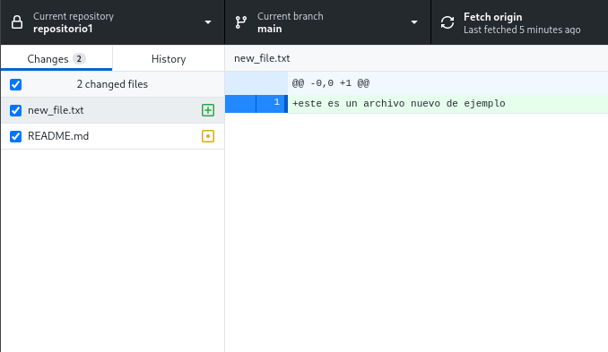

## Uso Básico

En esta sección veremos el uso basico de `Git` usando la aplicación `GitHub Desktop`. Se asumirá que ya tienes un repositorio clonado de manera local en tu computador ([Ver sección anterior](#repos_config) )

Se verán los conceptos de

* commit
* branch
* push

### Registrar cambios en el repositorio (Commits)
Cuando hacemos cambios en un repositorio, GitHub Desktop lo mostrara de esta manera.

con un signo
**[+]**
veremos los 
**[•]**
