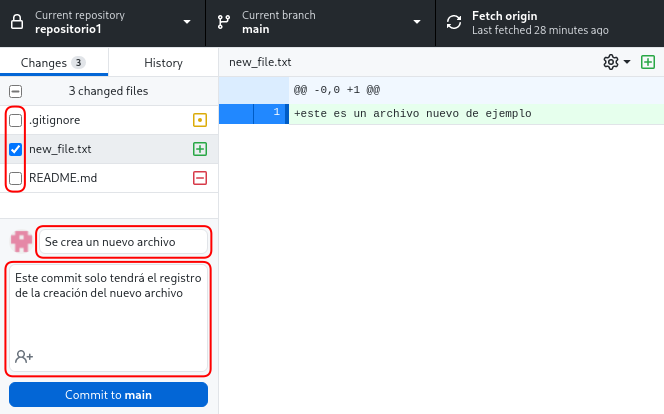
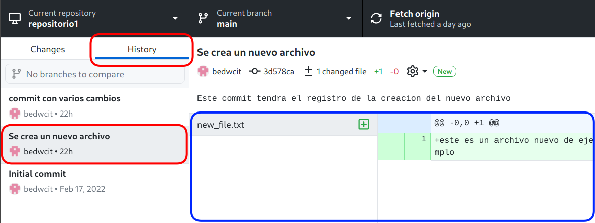
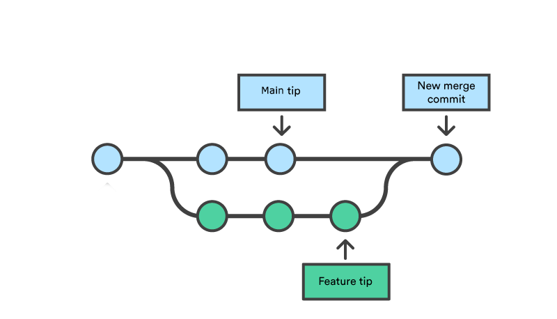
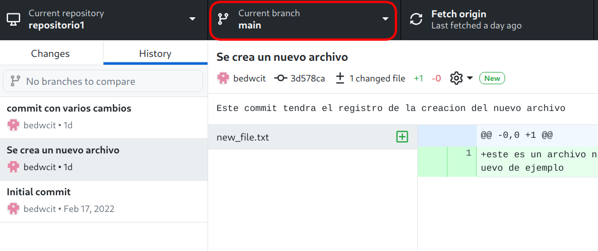

## Uso Básico

En esta sección veremos el uso basico de `Git` usando la aplicación `GitHub Desktop`. Se asumirá que ya tienes un repositorio clonado de manera local en tu computador ([Ver sección anterior](#repos_config) )

Se verán los conceptos de

* commit
* branch
* push

### Commits

Los `commits` son la parte esencial `git`. Estos corresponden a **registros** de *cambios* que se hacen en una carpeta (repositorio). Generalmente los *cambios* que un repositorio puede tener son: Que se cree un archivo nuevo, que se elimine un archivo ya existente, o que un archivo ya existente sea modificado.

#### Ver y reconocer cambios en el repositorio {-}
Cuando hacemos cambios en un repositorio, GitHub Desktop lo mostrara de esta manera.

 El signo
**[+]** significa que el archivo es nuevo, mientras que el signo **[•]** significa que el archivo ya existía, pero que ha sido modificado.
Por último, **[–]** indica que un archivo ha sido borrado.

#### Crear registro (commit) {-}

Para crear un `commit`, seleccionamos en la barra lateral de la izquierda, que cambios queremos registrar. Luego nos vamos a la parte inferior donde tendremos que ponerle un nombre al commit, y opcionalmente una descripción. 

Para finalizar hacemos click en el botón azul <code>Commit to **main** </code>

<figure class=" block-color-gray_background callout">

En el botón azul, el nombre de la rama ( en este caso <code>**main**</code>), puede cambiar según la rama en que estemos.

</figure>

#### Ver historial de cambios {-#gd_log}

Si nos vamos a la pestaña `history`  veremos un registro de todos los `commits` realizados. En esta lista, el primer `commit` (de arriba hacia abajo) es el `commit` más reciente, y los que siguen hacia abajo son cada vez más antiguos.

Si hacemos click en alguno de los registros podremos observar los cambios registrados en ese `commit`. Para cada archivo (modificado), en caso de ser un archivo de texto, veremos en verde las lineas nuevas y en rojo las eliminadas. Por otro lado, por ejemplo, si es una imagen la que ha sido modificada, podremos visualizar como esta era antes y despues. 

### Branches (Ramas)

Las `branches` (ramas) son un una funcionalidad muy util de `git`. Estas nos permiten, entre otras cosas, explorar e intentar cosas nuevas en un proyecto, sin el temor de echar a perder todo lo que ya esta bueno (y funcionando).

Para imaginarnos esto mostraremos unos ejemplos en las siguientes imagenes.

Por defecto, **siempre se tiene una *rama principal***, que se suele llamar `main` (o `master`) y se crea automáticamente cuando se crean los repositorios. De alguna forma, todo lo ya hemos visto ha sido en la rama `main`. 

Acá tenemos una representación del historial de `commits`, algo que [ya vimos](#gd_log) en la aplicación Github Desktop. En esta cada círculo es un `commit` y tiene un orden cronológico de izquierda a derecha. Es decir el primer `commit` que se hizo fue el `a`,  luego se hizo el `b`, y por último el `c`. 

Lo importante es que todos los círculos (`commits`) **tienen el mismo color**, indicando que **pertenecen a la misma rama**. En particular en este caso estamos representando la rama principal (`main`)

Entonces, ahora, una `branch` (rama) (a partir de la rama principal), en términos simples, es una "copia" de nuestro espacio de trabajo, **manteniendo los `commits` antiguos** de la rama principal, pero permitiendo que los **nuevos `commits` queden aislados**.

En esta figura, el orden cronológico de los `commits` también es de izquierda a derecha. Sin embargo, podemos observar que hay ramas presentes. Estas tienen un color distinto al de la rama principal (celeste), e indican, por ejemplo, la implementación de pequeñas o grandes características.

Una cosa importante a considerar, es que se hace con las ramas luego de que lo que se ha implementado en estas (solución de algún error, nueva función o característica) está listo. Las ramas, pueden *fusionarse* en un proceso que se llama `merge`, que veremos más adelante. Generalmente la rama principal es la que se *"fusiona"* obteniendo los cambios de las ramas paralelas, para luego seguir el desarrollo en la rama principal.

Un ejemplo de esto se muestra en la siguiente figura.

#### Crear una rama

