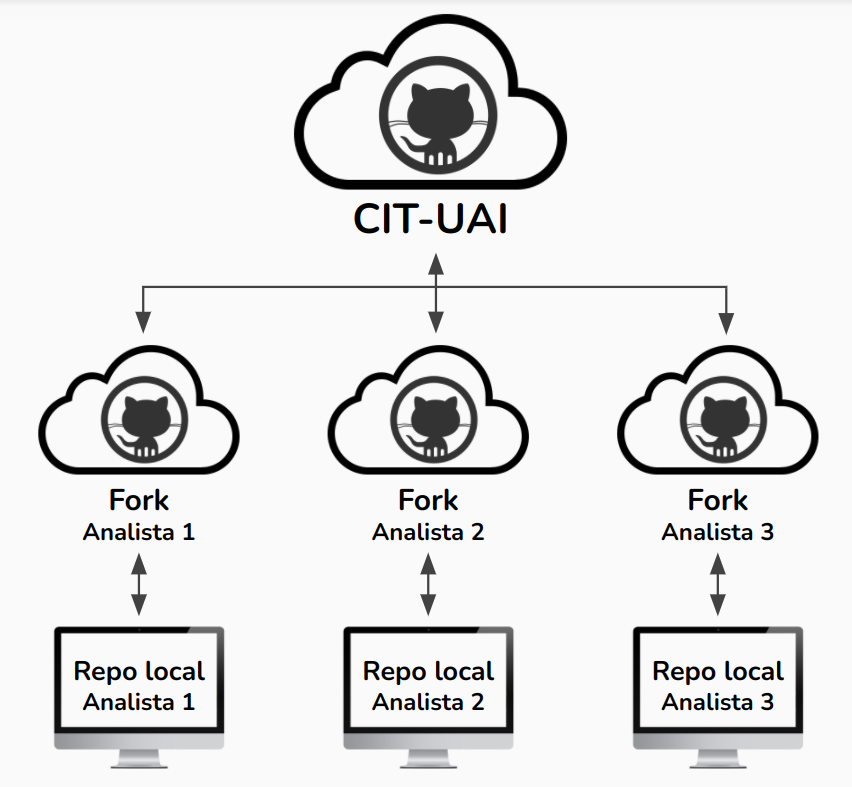

## Uso Colaborativo

En esta sección veremos prácticas recomendadas para el trabajo colaborativo, usando GitHub

### Forks {#forks}

Anteriormente ya vimos como crear `forks`, pero es importante resaltar su utilidad. 

Estos nos permiten tener una *"copia"* individual de un repositorio, en el cual podemos desarrollar partes del proyecto con cierta libertad. Todo esto, con el fin posterior de **proponer**, lo que hayamos desarrollado, al repositorio original.

En esta figura vemos la estructura recomendada para el flujo de trabajo. Para un proyecto, el repositorio principal se ubicará en el perfil de la organización (CIT-UAI), mientras que cada desarrollador tendrá su propio `fork`.

Se recomienda en el `fork` usar ramas. Por ejemplo si se desea implementar una nueva característica, llamar la rama con un nombre acorde a lo que se planea desarrollar (ej: `new_functions`). Luego, trabajar en ella y registrar varios `commits` con los avances, para luego, *proponer* los `commits` al repositorio principal (el de la organización) con una `pull request`.

#### Pull requests {-}

GitHub (y otras plataformas similares) nos permiten hacer `pull requests`. Estas consisten en proponer una serie de `commits` a un repositorio principal. La ventaja es que permite a los desarrolladores observar cada cambio, comentar cada detalle, y evaluar si se añaden los `commits` al repositorio principal.

En esta figura se muestra un ejemplo de como se crea una `pull request`. Vemos como se compara el repositorio que pertenece al perfil CIT-UAI con el que pertenece a la cuenta personal (`fork`). De igual forma notamos que se está comparando la rama `main` del repositorio principal, con la rama `dev` del `fork`. 

Luego de crear la PR vemos cuantos `commits` de diferencia hay entre el repositorio principal y el `fork` personal. Si nos vamos a la pestaña `Files Changed` veremos todos los archivos modificados considerando todos los `commits` en que difieren los repositorios.

