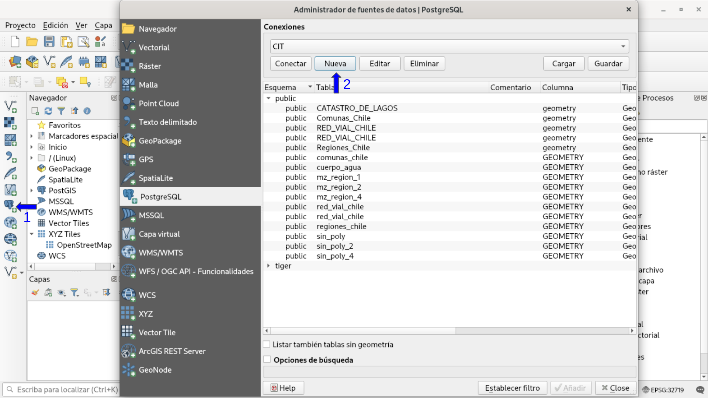
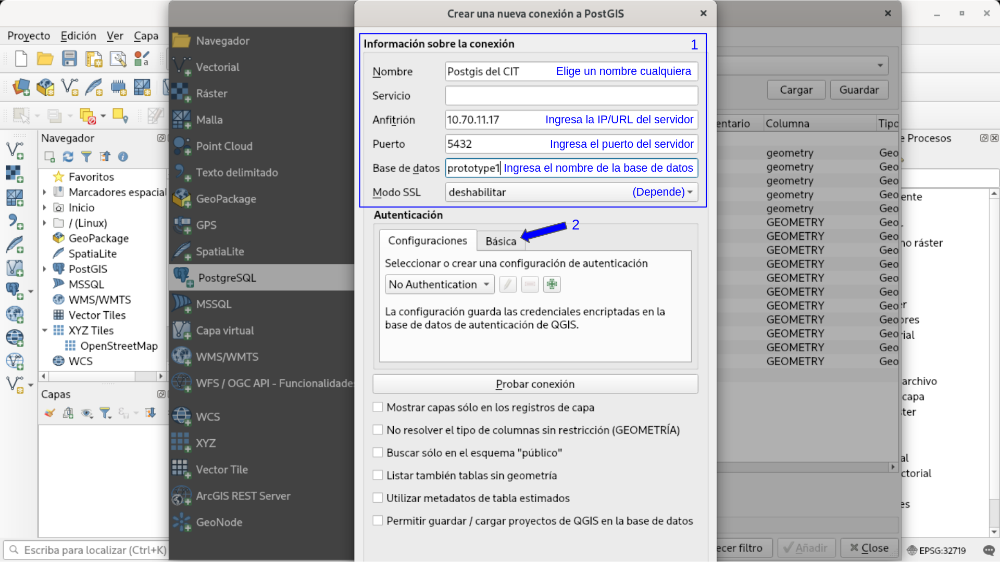
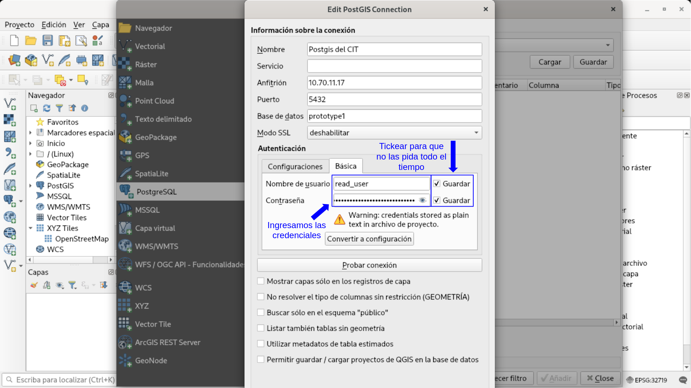
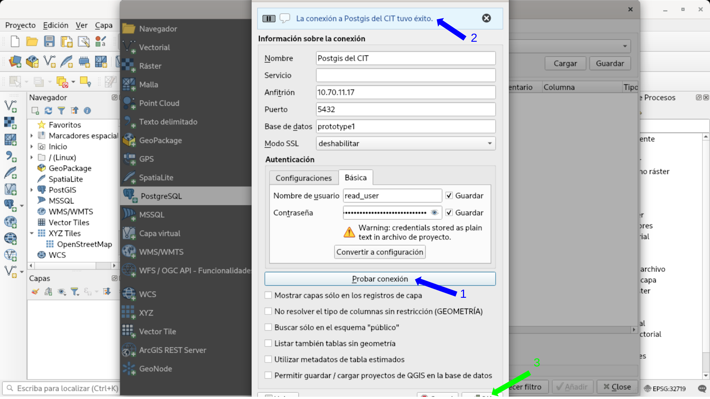
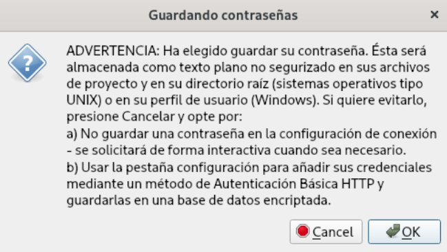
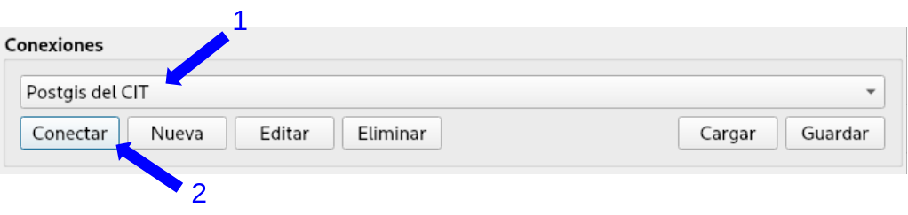
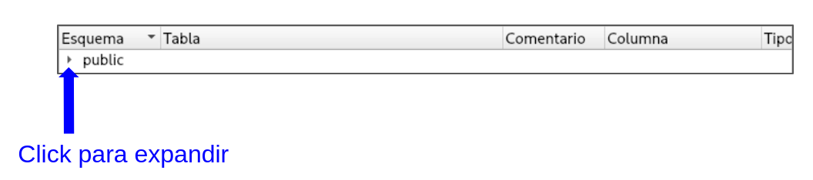
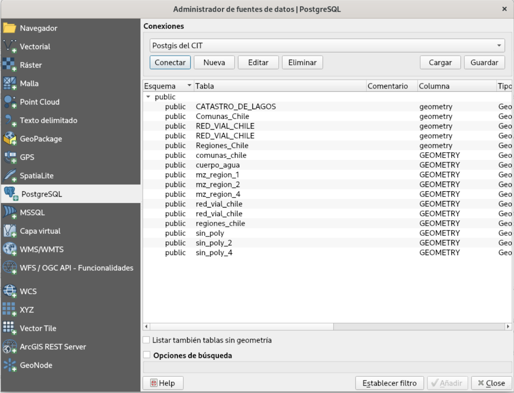
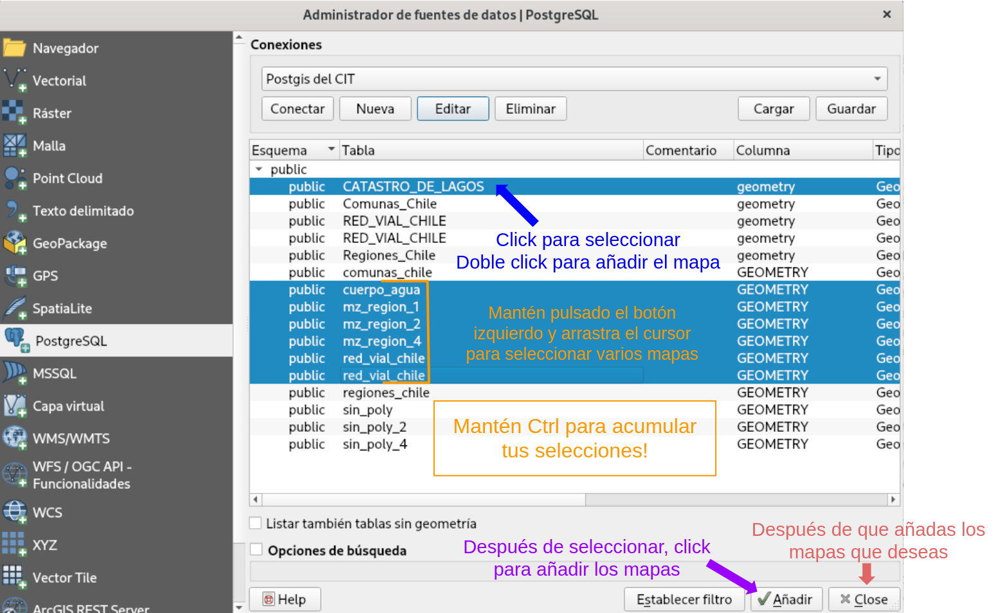
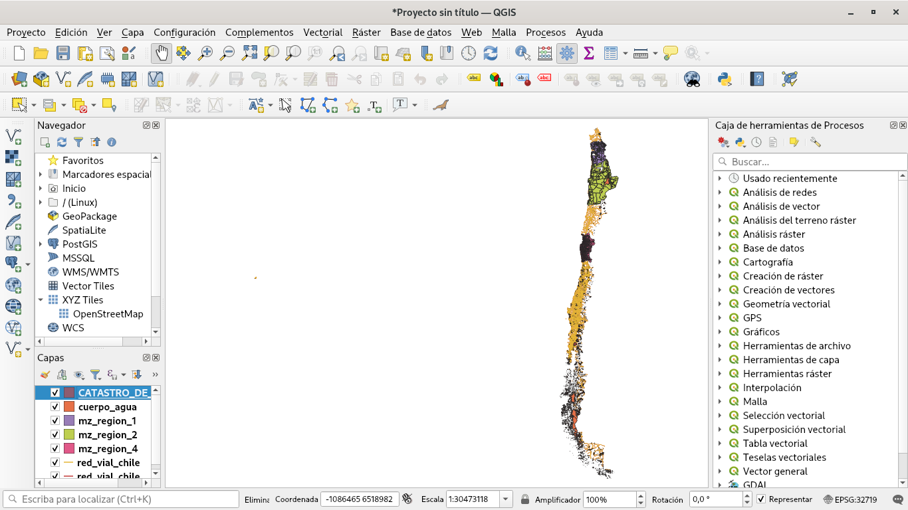

## Conección desde QGIS a PostgreSQL

### Crear Conección

Para poder conectarse a PostgreSQL o a cualquier base de datos, debemos crear la conección desde QGIS, para eso, tenemos que indicarle lo siguientes datos:

* IP/URL del Servidor
* Credenciales
+ Usuario
+ Clave
* Nombre de la base de datos a la cual nos conectaremos
* Puerto, usualmente es el 5432 pero puede cambiar dependiendo del servidor

Para comenzar vamos a QGIS y seguimos los siguientes pasos, los cuales solo debemos hacer la primera vez, siempre y cuando elijamos recordar el usuario y clave, en caso de no recordarlos, cuando queramos conectarnos nos va a pedir nuevamente el usuario o la clave dependiendo de que le indicamos que recuerde.

#### Abrir interfaz para añadir mapa Postgis

1. En el panel de herramientas izquierdo hacemos clic al icono de PostgreSQL

2. Hacemos click en "Nueva" para crear una conección a una base de datos de un servidor

#### Ingresar datos del servidor

Debemos indicar dónde se encuentra el servidor, estos datos se los deben dar antes.

El único punto que debemos tener consideración es en el Modo SSL.

¿Qué es el modo SSL? Es una forma de hablar con el servidor, sin embargo con esta opción activa (seleccionando "require") toda la comunicacion sera encriptada, solo quien se conecte y el servidor sabrá que están haciendo, es el ideal para comunicarse, sin embargo este método tiene un precio para todo lo que realicemos en QGIS, un precio en tiempo, tiempo extra que los PC tendrán que encriptar y desencriptar toda la información, y hará más lento todo lo que realizamos, debido a eso están las siguientes consideraciones.

Si estamos trabajando desde la red de trabajo, osea tenemos el servidor de PostgreSQL al lado nuestro, o estamos usando algún servicio como VPN o red privada, si tenemos alguna opción que da seguridad a nuestra red y conexión, podemos evitar usar el modo SSL.

Si estamos sin protección alguna, o fuera del área de trabajo, el modo SSL es prácticamente obligatorio, ¿qué pasa si no uso SSL y estoy en un lugar público?

En esencia, sin SSL cualquiera con conocimientos de TI podrá leer todo lo que haces y escribes en la red, no es problema si lo leen personas del trabajo si es información pública a la empresa, pero en un lugar público conlleva:

* Posible robo de credenciales del servidor
* Posible robo de información del servidor
* Posible alteración de la información enviada al servidor
* Posible hackeo al servidor

"Esto me da miedo, ¿como no me han robado antes datos como mis cuentas de mail?" Es por que en el internet, SSL es un estándar, en este tiempo toda página que tenga datos sensibles usará SSL por defecto, de esa manera te puedes conectar de forma segura incluso en lugares públicos, cuando entras a una pagina podras ver lo siguiente.

El candado indica que estás navegando por SSL y que la conexión es segura, si alguna vez navegamos a una página y el candado no esta, o esta rojo o el navegador indica "La página no es segura", el posible que estén tratando de robar información, es uno de los métodos preferido para robar por ejemplo, cuentas bancarias.

Aun así, no todas las páginas de ese tipo son intentos de robos, puede que la página sea oficial, pero se le olvidó renovar el certificado, pero como no podemos distinguirlo de un robo de información real sigamos el siguiente criterio.

"Únicamente escribir información sensible si la página usa SSL, y el candado está y sin advertencias, da lo mismo que la página que veamos se parezca al banco, al mail o similar, confía más en el candado SSL a lo que ve la vista. Confía más en la tecnología de criptografía o encriptación antes que la apariencia."

#### Ingresar credenciales

En este paso vamos a ingresar el usuario y clave del servidor, además, si lo vamos a usar de forma continua podemos tickear "Guardar" para el usuario y la clave, ya que por cada intento de conexión solicitará los datos no guardados.

#### Probar la conección

Antes de proceder a cargar mapas, es bueno revisar que los datos que ingresamos estén correctos, para eso hacemos click al botón "Probar conexión" y después de un poco de tiempo debería aparecer un mensaje indicando que la conexión fue exitosa.

En caso de que falle, intentar volver a escribir y verificar los datos tanto del servidor como las credenciales, si aun así no se logra la conexión, comunicarse con TI.

Finalmente vamos a hacer click para guardar la conexión.

Si decidimos guardar las credenciales aparecerá el siguiente mensaje:

QGIS guarda los datos en un archivo, tal cual, eso causa que cualquier persona con acceso al computador pueda recuperar las credenciales, por lo que se debe tener precaución.

Antes que guiarnos por el miedo, podemos tomar las siguientes precauciones:

* Mantengamos el computador con clave
* Evitar que personas ajenas tengan acceso al computador
* Si roban el computador, avisar al área de TI para cambiar las claves

Nada es perfecto, pero con estas dos precauciones se mantiene un buen margen de seguridad, solo hay que considerarlas.

Con esto, hemos guardado la conexión y podemos acceder al servidor y su base de datos.

### Cargar mapas desde PostGIS

Cargar mapas es bastante simple, muy similar a un archivo una vez que realizamos los procedimientos previos, primero:

1. Seleccionamos la sección, tendrá el nombre que elegimos en la sección anterior.
2. Seleccionamos "Conectar", si no guardamos el usuario y/o clave del servidor, las volverá a solicitar.

Con la conexión realizada veremos una lista con los esquemas del servidor, como idea general, cada esquema es una carpeta que contiene varios shp o mapas, ayuda a ordenar y clasificar, por defecto, los servidor usan el esquema "public" para guardar todo ahí a menos que indiquemos otra cosa.

Al expandir el esquema, podremos ver todos los mapas que contiene, ahora solo tenemos que añadir los que deseamos ver en QGIS.

Como podemos notar, tenemos varias formas de seleccionar mapas:

* Click a un mapa
* Mantener el botón izquierdo del mouse y arrastrarlo, se seleccionarán todos los mapas por los que pasemos

Si además mantenemos la tecla "Ctrl", podemos añadir nuevas selecciones de mapas, manteniendo los mapas ya seleccionados.

Una vez seleccionamos los mapas de interés, hacemos click al botón "Añadir", la ventana no se cerrará por si quieres añadir aún más mapas.

Es posible seleccionar el esquema "public" o el que desees y añadir todos sus mapas a QGIS directamente.

Una vez con todos los mapas cargados hacemos click en "Close" para salir de la interfaz para añadir mapas.

Como vemos en la imagen, todos los mapas han sido cargados y podemos usar QGIS de forma usual.

Si no puedes editar mapas, puede que no tengas credenciales para hacerlo, en todo caso, comunicarse con el área de TI para mayor información.

